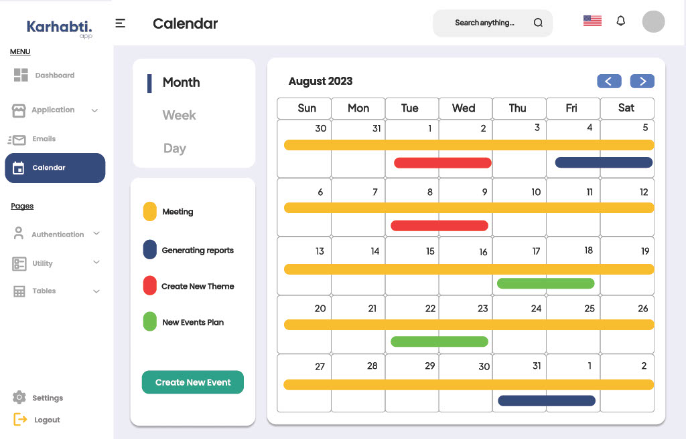

# Karhabti admin dashboard

This admin dashboard has been designed to significantly improve operational efficiency and data visibility within your organization. By integrating advanced features and optimizing the user experience, the dashboard facilitates smoother processes and more accurate data-driven decision-making.
## Features
#### Revenue Visibility

The dashboard provides comprehensive insights into revenue streams, allowing for real-time monitoring and analysis of financial performance.

#### Scheduling and Notifications

Advanced scheduling capabilities reduce the need for manual task management.
Automated notifications keep users informed of important events, deadlines, and updates, ensuring timely actions and responses.
#### Integrated Analytics Tools

Powerful analytics tools are embedded within the dashboard, offering detailed reports and visualizations.
These tools enhance the accuracy of data-driven decisions by providing deep insights into key metrics and trends.

#### Mobile Compatibility

The dashboard is fully optimized for mobile devices, ensuring that users can access and utilize its features on the go.
This mobile-friendly design improves the overall user experience by offering flexibility and accessibility.1

## Screenshots

